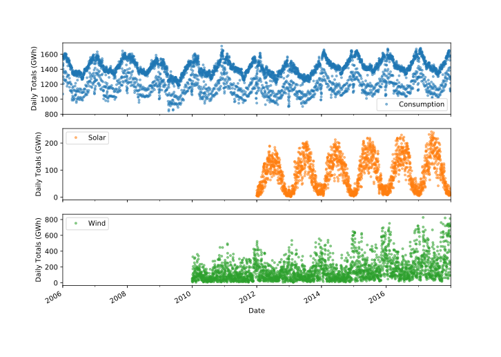

# Time-Series-Analysis-Power-Systems-Data

The data set: Open Power Systems Data
In this project, we’ll be working with daily time series of Open Power System Data (OPSD) for Germany, which has been rapidly expanding its renewable energy production in recent years. The data set includes country-wide totals of electricity consumption, wind power production, and solar power production for 2006-2017.

Electricity production and consumption are reported as daily totals in gigawatt-hours (GWh). The columns of the data file are:
- Date — The date (yyyy-mm-dd format)
- Consumption — Electricity consumption in GWh
- Wind — Wind power production in GWh
- Solar — Solar power production in GWh
- Wind+Solar — Sum of wind and solar power production in GWh

## Requirements
- Panda 0.23.3
- Matplotlib 2.2.2

source tutorial: [[GitHub Pages]([https://pages.github.com/](https://www.dataquest.io/blog/tutorial-time-series-analysis-with-pandas/)).](https://www.dataquest.io/blog/tutorial-time-series-analysis-with-pandas/)
